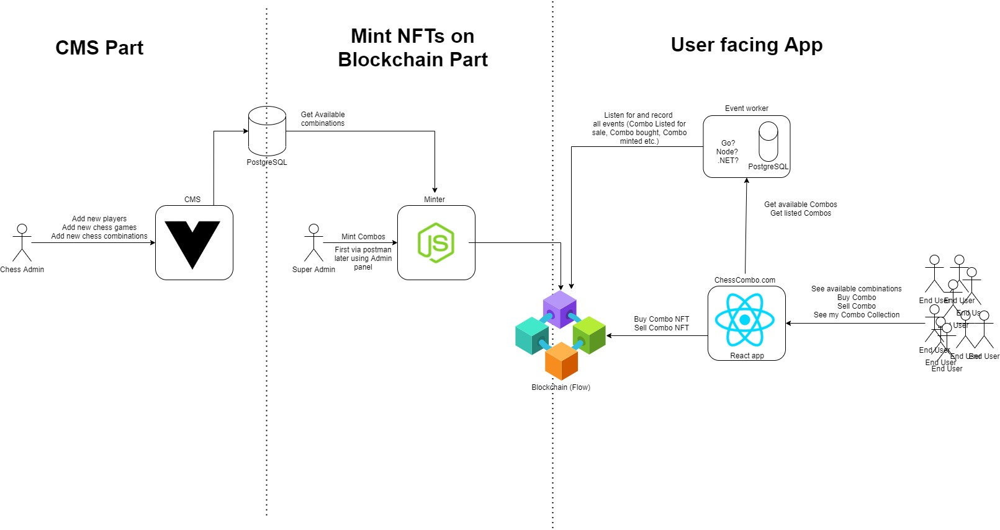

# Chess Combo CMS

CMS for adding combinations, players and games to backend.

## Frontend

It's Vue using a shitty ElementUI as UI framework. I tried to cut some corners by using already setup CMS template but it's pretty bad. Rewrite.

## Backend

.NET Core API with PostgreSQL as db. Best way to run it is to use a Docker image of Postgresql and provide connection string in appsettings.json

## Tasks

- Backend
- - Create another layer in backend so the Request flow goes like Controller -> Service -> DbContext. No DbContext should be mentioned anywhere in controllers.
- - Provide proper Input&Response model, no mention of the DB models should be inside controller layer
- - Replace temporary user logic in UserController with proper one. Add ASP.NET Identity.
- Frontend
- - Provide edit & delete feature for all three main entities (Players, Combinations and Games)
- - Plug in the login logic with the proper token you now get from backend
- - Figure out the retarded routing so editing/creating features for entities have proper route. For example, editing Game would go to /games/edit not /editGame
- - Add Category dropdown for creating Combination (Initial values can be hardcoded: QueenSacrifice, Endgame, Fork, Attack, Checkmate, Blunder, Opening)
- - Add Birthplace input field for creating a Player (free input field for now of player's Nation)

I know this is random but over time we'll figure out some good documentation if we continue developing this.

**UPDATE** I drew a diagram of the overall architecture. This Repo concerns itself with the left part.

**UPDATE**
API available on https://combo-cms-api.azurewebsites.net/swagger/index.html so you don't have to run it locally.
